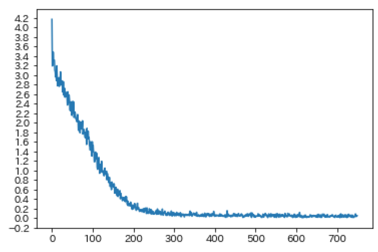
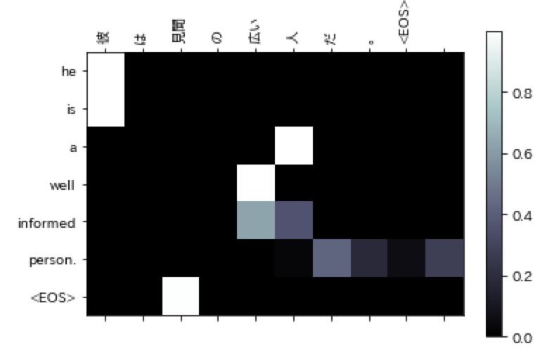
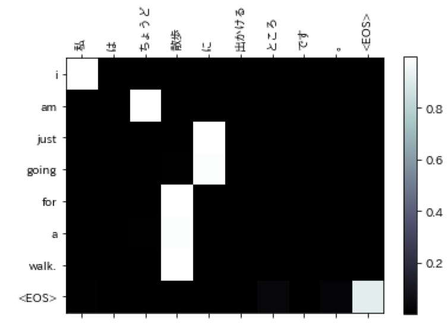
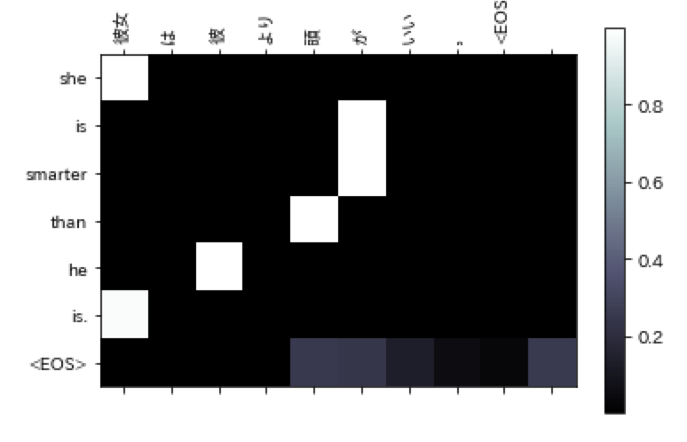

# Tiny Japanese to English Translator


A toy translator from Japanese to English using deep neural network.  
Specialized in Subject + Be-Verb form such as I am .., He is ... 

***Keywords:*** Deep Neural Machine Translation, Sequence to Sequence model, encoder/decoder, attention, PyTorch


## Training
### Sample Output
```
train_iters(encoder1, attn_decoder1, 75000, print_every=5000)
```

```
5m 31s (- 77m 16s) (5000 6%) 2.8059
10m 36s (- 68m 56s) (10000 13%) 1.8849
15m 47s (- 63m 9s) (15000 20%) 1.0232
21m 6s (- 58m 2s) (20000 26%) 0.4375
26m 42s (- 53m 25s) (25000 33%) 0.1726
...
```
### Loss Curve


## Translation
### Random Output
```
evaluate_randomly(encoder1, attn_decoder1)
```
```
> 彼女はのんきだ。
= she is easygoing.
< she is easygoing. <EOS>

> 彼はびくびくしている。
= he is afraid of his own shadow.
< he is afraid of his own shadow. <EOS>

> 彼は暮し向きが良い。
= he is well off.
< he is well off. <EOS>

> 私は一人っ子です。
= i am an only child.
< i am an only child. <EOS>

> 彼はかんかんに怒っている。
= he is boiling with rage.
< he is very angry. <EOS>

> 彼は私の古い友達です。
= he is my old friend.
< he is my old friend. <EOS>

...
```

### Sample Output

```
evaluate_and_show_attention("彼は見聞の広い人だ。")
```
```
input = 彼は見聞の広い人だ。
output = he is a well informed person. <EOS>
```


```
evaluate_and_show_attention("私はちょうど散歩に出かけるところです。")
```
```
input = 私はちょうど散歩に出かけるところです。
output = i am just going for a walk. <EOS>
```


```
evaluate_and_show_attention("彼女は彼より頭がいい。")
```
```
input = 彼女は彼より頭がいい。
output = she is smarter than he is. <EOS>
```

## ToDo
- Try other verb form (non be-verb form) and verify the quality

## Environment
- Python 3.6
- PyTorch 0.3

## Reference

- Translation with a Sequence to Sequence Network and Attention
https://pytorch.org/tutorials/intermediate/seq2seq_translation_tutorial.html